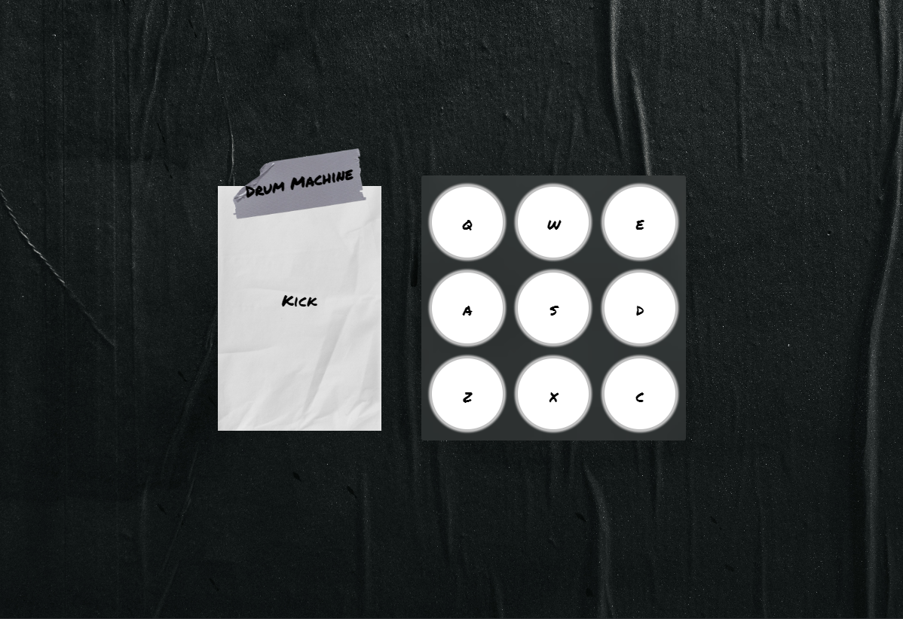

# Drum Machine 🥁

## Description 

A **React Drum Machine** app where users can click on drum pad elements to trigger audio samples unique to that pad / key on the keyboard.

A FreeCodeCamp Front End Development Libraries project, with the objective to fulfill the user stories and get all of the tests to pass.

## Built with

## Snapshot 

## Link
[Drum Machine](https://react-app-drum-machine.netlify.app/)

## User Stories 
~~~~
User Story #1: I should be able to see an outer container with a corresponding id="drum-machine" that contains all other elements.

User Story #2: Within #drum-machine I can see an element with a corresponding id="display".

User Story #3: Within #drum-machine I can see 9 clickable drum pad elements, each with a class name of drum-pad, a unique id that describes the audio clip the drum pad will be set up to trigger, and an inner text that corresponds to one of the following keys on the keyboard: Q, W, E, A, S, D, Z, X, C. The drum pads MUST be in this order.

User Story #4: Within each .drum-pad, there should be an HTML5 audio element which has a src attribute pointing to an audio clip, a class name of clip, and an id corresponding to the inner text of its parent .drum-pad (e.g. id="Q", id="W", id="E" etc.).

User Story #5: When I click on a .drum-pad element, the audio clip contained in its child audio element should be triggered.

User Story #6: When I press the trigger key associated with each .drum-pad, the audio clip contained in its child audio element should be triggered (e.g. pressing the Q key should trigger the drum pad which contains the string Q, pressing the W key should trigger the drum pad which contains the string W, etc.).

User Story #7: When a .drum-pad is triggered, a string describing the associated audio clip is displayed as the inner text of the #display element (each string must be unique).
~~~~

## Credits

[Nathan Dumlao](https://unsplash.com/@nate_dumlao?utm_source=unsplash&utm_medium=referral&utm_content=creditCopyText)

[Marjan Blan](https://unsplash.com/@marjan_blan?utm_source=unsplash&utm_medium=referral&utm_content=creditCopyText)

Favicon:
[Freepik](https://www.flaticon.com/free-icons/drum)

## License
Licensed under the MIT license.

## Questions 
[Email Me](Chloe.a.harris17@gmail.com) if you have any questions.

Check out more of my work on [GitHub](https://github.com/chloeharris1).
  

